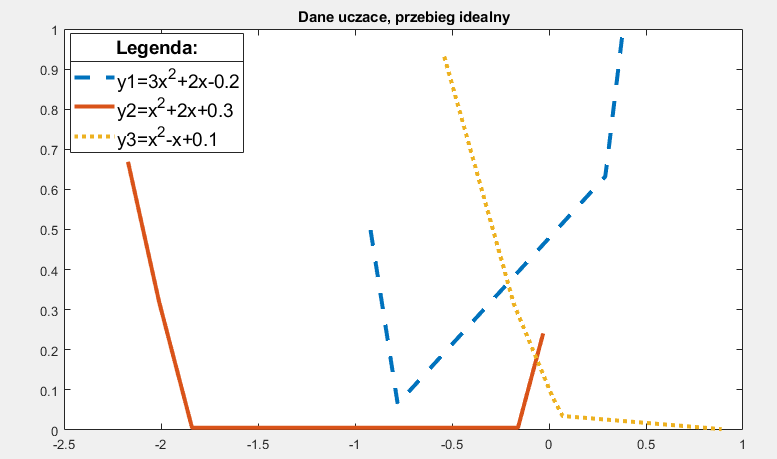
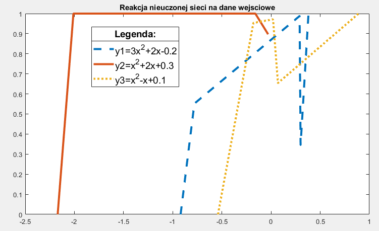
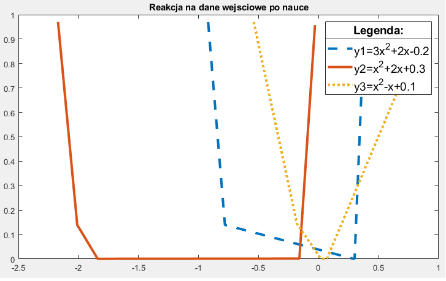
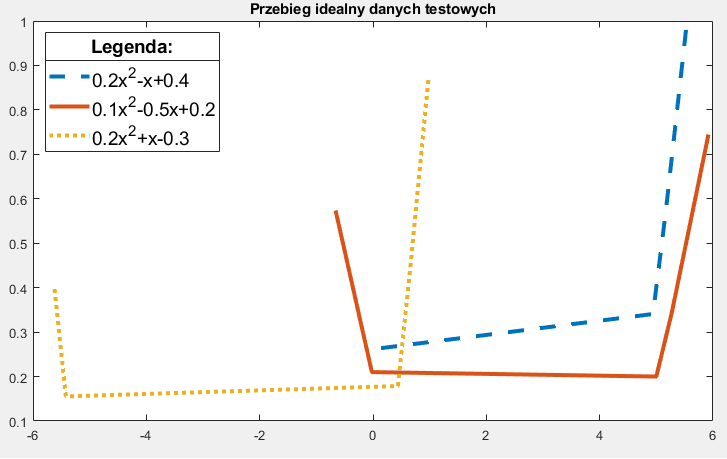
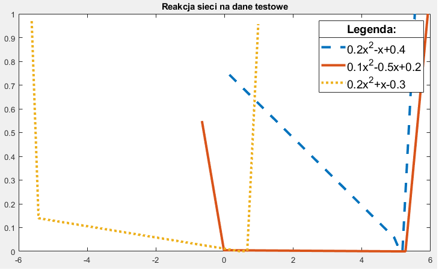

# MLP-Neural-Network-in-Matlab
This repository includes implementation of MLP Neural Network structure. It also contains an example of learning and testing this network in quadratic function approximation problem.

Table of contents
=================

<!--ts-->
   * [Table of contents](#table-of-contents)
   * [Code description](#code-description)
   * [Graphical results](#graphical-results)
   Polish Language:
   * [Opis w języku polskim](#opis-w-języku-polskim)
   * [Graficzne przedstawienie wyników](#graficzne-przedstawienie-wyników)
<!--te-->

(ENG) Code description
======================

*Project contains 7 methods and one main file which uses that methods. A short description is provided below:*

1. Method "utworz" - initializes a neural network for input parameters. Two weight matrices are created (for output and hidden layer).
2. Method "przetwarzaj" - gives a network responce for input paremeters - vector as output.
3. Method "nauka" - this is the most important part of project. Main aim of this method is modification of weight matrices to approximating quadratic function.
4. Method "LosowanieUcz" - generates learning data (number of data is choosen by user) from three nonlinear functions.
5. Method "LosujFkcTestujace" - this method is similar to previous one, but this time it generates testing data form other nonlinear functions.
6. Method "sortowanie" - data from method 4. and 5. are not sorted - this method is used to sort data (we can properly show data on figure/plot).
7. Method "rysuj" - this method provides drawing a figures. It helps to visualise learning process - we can see a learning and testing data and response of our network.
8. Main program file "mlpTest" - collect user parrameters (typing on keyboard) and creates choosen MLP stucture by learning it on learning data and after that - show results for testing data. The final result of this program is showing a plots which present MLP learning process. This program uses every of previous methods.

(ENG) Graphical results
=======================

* Learning data. Figure below presents learning data of choosen quadratic function:

* Figure below shows a response of neural network after initialization:

* Response of network after learning:

* Testing dataset is presented below:

* Results of neural network for testing data below:

As can be seen from the above figures, neural network can approximate shape of quadratic function. The parametters of network were choosen by trial and error method.
If you want to learn more, contact me on github @MarcinJ7.

(PL) Opis w języku polskim
==========================

Krótki opis każdej z wykorzystanych funkcji : 
*W programie zostało wykorzystanych 7  funkcji. Mamy również jeden główny plik programu, w którym wykorzystywane są funkcje w celu uzyskania wyniku końcowego. Teraz pokrótce opiszę cel implementacji każdej z funkcji:*

1. Funkcja „utworz” – celem implementacji tej funkcji jest inicjalizacja sieci dla parametrów wejściowych. Zostaje to dokonane poprzez utworzenie dwóch macierzy wag (warstwy ukrytej oraz wyjściowej).  
2. Funkcja „przetwarzaj” – funkcja ma na celu uzyskanie odpowiedzi sieci neuronowej na dane wejściowe w postaci wektora. Wynikiem jej działania jest wektor wyjściowy. 
3. Funkcja „nauka” – jest to najważniejsza z funkcji programu – jej celem jest modyfikacja macierzy wag w taki sposób, aby jak najlepiej aproksymować funkcję. Na wejścia podawane są losowe, utworzone wcześniej przykłady uczące. Wykorzystany został tutaj algorytm wstecznej  propagacji błędu.  
4. Funkcja „LosowanieUcz” – jej zadaniem jest wygenerowanie zadanej liczby argumentów danych służących do uczenia (wejść  i wyjść) pozyskanych z trzech nieliniowych funkcji. Te nieliniowe funkcje zostały zapisane w ciele funkcji „LosowanieUcz”.  
5. Funkcja „LosujFkcTestujace” – jej zadaniem jest wygenerowanie zadanej liczby argumentów danych służących do testowania nauczonej sieci (wejść i wyjść) pozyskanych z trzech nieliniowych funkcji. Podobnie jak w poprzedniej metodzie, nieliniowe funkcji zostały zapisane w ciele funkcji „LosujFkcTestujace”. 
6. Funkcja „sortowanie” – dane uzyskane z powyższych funkcji „LosujFkcTestujace” i „LosowanieUcz”  są nieposortowane, co uniemożliwia ich przedstawienie w postaci prawidłowego wykresu. Dlatego niezbędne jest użycie funkcji sortującej dane (w kolejności od najmniejszej do największej wartości). Po wykonaniu tej funkcji na danych, są one gotowe do przedstawienia na wykresie.  
7. Funkcja „rysuj” – zadaniem tej funkcji jest odpowiednie wyrysowanie wykresu – dla danych wejść i wyjść. Funkcja również dodaje odpowiedni tytuł oraz legendę do powstałego wykresu. Dzięki temu interpretacja uzyskanych wyników jest bardzo łatwa. 
8. Plik główny programu „mlpTest” –  plik ten tworzy cały program – na podstawie wprowadzanych danych wywoływane są powyższe funkcje, prowadząc docelowo do wyświetlenia wykresów prezentujących uczenie się sieci neuronowej.  

(PL) Graficzne przedstawienie wyników
=====================================

* Dane uczące (trzy wybrane funkcje kwadratowe)

* Odpowiedź sieci tuż po inicjalizacji wag

* Odpowiedź sieci po nauce 

* Dane testowe

* Odpowiedź sieci na dane testowe

Jak widać na powyższych zrzutach ekrenu, sieć pozwala na aproksymację kształtu funkcji z wykorzystaniem dostepnych danych. Parametry sieci neuronowej dobierane były metodą prób i błędów.

W razie pytań służę pomocą - kontakt poprzez Githuba @MarcinJ7
